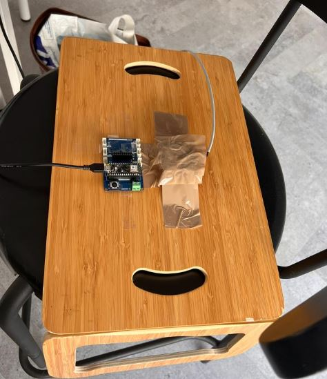

The dataset we created using the shaker taped on the wooden board. Each dataset consists of around 5 minutes of accelerometer data collection using different Hz and volume settings from https://www.szynalski.com/tone-generator/. 

Here is a picture of the setup we used to collect data.

